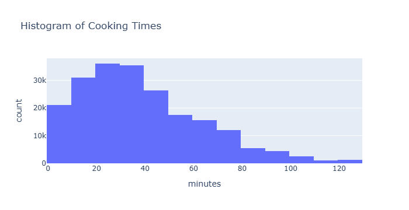
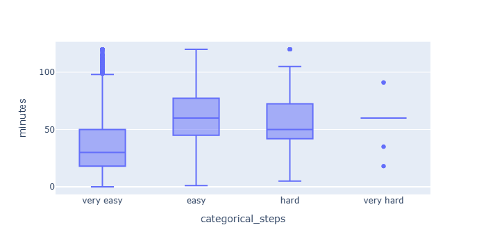

# Prediction of Minutes using different columns

**Name(s)**: Yixuan Xin, Felix Najera

**Website Link**:[ (https://folicks.github.io/recipe_satisfaction/)]

## introduction

Recipe and rating is an important reference when we making food, providing reliable indication of the food quality and taste, as well as the energy and complexity to finish cooking. Time, in nowadays, becomes more crutIal when people live in such a high speed life, so understanding what factors are correlate with it is one question we are interested in. In our project, we focus on how to predict the cooking time(minutes) utilizing different categorical, numerical, and textual features. Our model tries to use statistical analysis method, including permutation test, hypothesis tests and the missing data analysis to conduct the exploratory analysis. We also build decision tree regressor to predict the detailed relationship between them. Overall, this project aims to shine light on how to make people more efficient cooking food with viable time management. 

Research Questions: The research question we have is how to predict the cooking time. We want to use factors from the dataframe to predict using a regression model.

<table border="1" style="border-collapse: collapse; width: 100%; text-align: left;">
  <thead>
    <tr>
      <th>Column</th>
      <th>Description</th>
    </tr>
  </thead>
  <tbody>
    <tr>
      <td>Name</td>
      <td>Name of recipe</td>
    </tr>
    <tr>
      <td>Id</td>
      <td>Recipe id</td>
    </tr>
    <tr>
      <td>Minutes</td>
      <td>Time to cook</td>
    </tr>
    <tr>
      <td>Contributor_id</td>
      <td>User id who uploaded the recipe</td>
    </tr>
    <tr>
      <td>Submitted</td>
      <td>Date recipe was uploaded</td>
    </tr>
    <tr>
      <td>Tags</td>
      <td>Food.com tags for recipe</td>
    </tr>
    <tr>
      <td>Nutrition</td>
      <td>Nutrition information (calories, total fat, sugar, sodium, protein, saturated fat, etc.)</td>
    </tr>
    <tr>
      <td>N-steps</td>
      <td>Number of steps to cook</td>
    </tr>
    <tr>
      <td>Steps</td>
      <td>Text for recipe steps in order</td>
    </tr>
    <tr>
      <td>Description</td>
      <td>User-provided description</td>
    </tr>
    <tr>
      <td>Ingredients</td>
      <td>Text for recipe ingredients</td>
    </tr>
    <tr>
      <td>N-ingredients</td>
      <td>Number of ingredients in recipe</td>
    </tr>
  </tbody>
</table>

The second dataset interactions have 731927 rows and 5 columns.
<table border="1" style="border-collapse: collapse; width: 100%; text-align: left;">
  <thead>
    <tr>
      <th>Column</th>
      <th>Description</th>
    </tr>
  </thead>
  <tbody>
    <tr>
      <td>user_id</td>
      <td>user ID</td>
    </tr>
    <tr>
      <td>recipe_id</td>
      <td>Recipe ID</td>
    </tr>
    <tr>
      <td>Date</td>
      <td>Date of interaction</td>
    </tr>
    <tr>
      <td>Rating</td>
      <td>Rating given</td>
    </tr>
    <tr>
      <td>Review</td>
      <td>Review text</td>
    </tr>
  </tbody>
</table>

The two Dataframe both have recipe_id(id) and also the columns we are interested in, including ’n-steps’, ’n-ingredidents’, ‘tags’ and ‘description’. Specifically, the dataset has a strong skewed trend of the features, even include our interesting factors, so to better capture the most data we need to clean the dataset and focus on the main part of them.

## Data Cleaning and Exploratory Data Analysis

We do several steps to make our data more concise and useful. Here are the steps we conduct:
1. Merging two dataframes together: We left merge the two dataset on the id column so it will keep all rows food have and help to match all unique recipes with it’s ratings and reviews. 
2. Filling ratings with null values: We fill all ratings of 0 with np.nan, and the purpose is to filter invalid reviews. Since the rating will start from 1 to 5, 0 represents missing values.
3. We create another column ‘average_rating’ which is the rating per recipe by using groupby and mean function, and then we add this series back to the original dataframe using merge again.
4. We clean up the outliers for the minutes column. As we see that the max value of ‘minutes’ is 1051200, while the minimum value is 0, meaning the range is too large to incorporate, so we decide to remove outliers outside the 1.5 interquartile range but only keep the middle.

All the columnns of the cleaned df include:
<table border="1" style="border-collapse: collapse; width: 100%; text-align: left;">
  <thead>
    <tr>
      <th>Column</th>
      <th>Description</th>
    </tr>
  </thead>
  <tbody>
    <tr>
      <td>Name</td>
      <td>Name of recipe</td>
    </tr>
    <tr>
      <td>Id</td>
      <td>Recipe id</td>
    </tr>
    <tr>
      <td>Minutes</td>
      <td>Time to cook</td>
    </tr>
    <tr>
      <td>Contributor_id</td>
      <td>User id who uploaded the recipe</td>
    </tr>
    <tr>
      <td>Submitted</td>
      <td>Date recipe was uploaded</td>
    </tr>
    <tr>
      <td>Tags</td>
      <td>Food.com tags for recipe</td>
    </tr>
    <tr>
      <td>Nutrition</td>
      <td>Nutrition information (calories, total fat, sugar, sodium, protein, saturated fat, etc.)</td>
    </tr>
    <tr>
      <td>N-steps</td>
      <td>Number of steps to cook</td>
    </tr>
    <tr>
      <td>Steps</td>
      <td>Text for recipe steps in order</td>
    </tr>
    <tr>
      <td>Description</td>
      <td>User-provided description</td>
    </tr>
    <tr>
      <td>Ingredients</td>
      <td>Text for recipe ingredients</td>
    </tr>
    <tr>
      <td>N-ingredients</td>
      <td>Number of ingredients in recipe</td>
    </tr>
    <tr>
      <td>user_id</td>
      <td>user ID</td>
    </tr>
    <tr>
      <td>recipe_id</td>
      <td>Recipe ID</td>
    </tr>
    <tr>
      <td>Date</td>
      <td>Date of interaction</td>
    </tr>
    <tr>
      <td>Rating</td>
      <td>Rating given</td>
    </tr>
    <tr>
      <td>Review</td>
      <td>Review text</td>
    </tr>
    <tr>
      <td>average rating</td>
      <td>average rating per recipe</td>
    </tr>
  </tbody>
</table>


conducted outlier removal on food[minutes] present in the dataset 


you found the 2nd step in creating a github webpage
heres an example of entire website written in markdown

goal find normal distribution of number of steps and length of time for recipe


| recipe_id | minutes | n_steps |
|-----------|---------|---------|
| 306785    | 40      | 4       |
| 310237    | 30      | 9       |
| 321038    | 22      | 14      |
| 321038    | 22      | 14      |
| 342209    | 40      | 7       |


| rating   |    0 |   1 |   2 |   3 |    4 |     5 |
|----------| -----|-----|-----|-----|------|-------|
| 1        |  123 |  22 |  18 |  65 |  416 |  1971 |
| 2        |  319 |  54 |  39 | 172 | 1060 |  5321 |
| 3        |  504 | 104 |  83 | 271 | 1663 |  8092 |
| 4        |  679 | 136 |  88 | 353 | 2080 |  9999 |
| 5        |  880 | 185 | 154 | 522 | 2736 | 11424 |
| 6        |  952 | 201 | 158 | 549 | 2883 | 12555 |
| 7        | 1099 | 182 | 178 | 578 | 3045 | 13430 |
| 8        |  996 | 183 | 159 | 523 | 2972 | 12688 |
| 9        | 1082 | 202 | 166 | 550 | 2761 | 12003 |
| 10       |  947 | 189 | 185 | 492 | 2457 | 10558 |
| 11       |  793 | 167 | 132 | 370 | 2012 |  9011 |
| 12       |  750 | 146 | 126 | 312 | 1826 |  7980 |
| 13       |  510 | 107 |  77 | 244 | 1470 |  6499 |
| 14       |  436 | 110 |  79 | 254 | 1190 |  5626 |
| 15       |  433 |  80 |  66 | 195 |  963 |  4529 |
| 16       |  425 |  66 |  66 | 166 |  771 |  3959 |
| 17       |  367 |  55 |  48 | 138 |  634 |  3304 |
| 18       |  254 |  44 |  29 |  87 |  541 |  2331 |
| 19       |  214 |  30 |  35 |  79 |  382 |  2080 |
| 20       |  204 |  30 |  28 |  68 |  379 |  1952 |
| 21       |  143 |  30 |  19 |  55 |  252 |  1395 |
| 22       |   88 |  18 |  19 |  49 |  194 |  1051 |
| 23       |  116 |  19 |   9 |  42 |  174 |  1045 |
| 24       |   89 |  11 |   9 |  25 |  117 |   615 |
| 25       |   78 |  16 |  18 |  28 |  108 |   594 |
| 26       |   51 |  13 |   5 |  31 |   87 |   446 |
| 27       |   


## Univariate Analysis
Look at the distributions of relevant columns separately by using DataFrame operations and drawing at least two relevant plots.
Embed at least one plotly plot you created in your notebook that displays the distribution of a single column (see Part 2: Report for instructions). Include a 1-2 sentence explanation about your plot, making sure to describe and interpret any trends present. (Your notebook will likely have more visualizations than your website, and that’s fine. Feel free to embed more than one univariate visualization in your website if you’d like, but make sure that each embedded plot is accompanied by a description.)

We conduct box plots for the column minutes and to have a peek of the distribution over all, and the result demonstrates that the range is too large, from 0 to 1 million, confirming the need of outliers removal we did above. The cleaned distribution is shown in the next graph. Now the range of the minutes is from 0 to 120.
<need uni_box>


The histogram reveals a right skewed trend, hinting most recipes are quick and some of them are designed for elaborate cooking processes.

## Bivariate Analysis
We try to create box-plot between the number of steps and minutes, but as the distribution shown before, 'n_steps' is a numerical feature so the box plot will have around 80 categories, so we divide n_steps into different categories manually to visualize the data clearly.


Descriptions: The median cooking time increases with recipe complexity, and the interquartile range(IQR) also improves as the steps increase. Thus, the trend may hints a positive correlation between the cooking time and the number of steps.


## Assessment of Missingness

As the series shows below, we have five columns containing missing values, including 'rating','review','name', 'description' and 'average_rating'. 

## NMAR Analysis
- **Average_rating**: Since 'average_rating' comes from 'rating', the missingness of 'average_rating' is highly correlated with another column, so its missingness should be 'MAR'(Missing At Random).
- **Review**: NMAR: Since there are 57 missing review, because people are less likely to leave comments if they are unsatisfied with the food or they have neutral feelings toward it. Name: MCAR; This is missed by accident because there is only one row over 234428 recipes, and it is possible the people just forget to put the name in.
- **Description**: MAR; since other columns are already enough to get the detail of the recipe, so adding more description may be necessary, but we will prove it in the next section.
- **Rating**: MAR; Rating is the missing part because we manually change 0 to np.nan to let it represent missing. We guess rating is missing due to other columns like n_steps based on the positive correlation we demonstrated in the bivariate analysis.
- 
## Missingness Dependency
- Null hypothesis: description is independent
- Alternative hypothesis: description depends other columns
- Test statistic: difference in mean
- Result: The permutation test shows that the p_value is 0.036, meaning we reject the null hypothesis that rating is independent under alpha=0.05; so description is MAR on the n_ingredients column.

When we try to run permutation test on a different column, minutes for description, we found that the p_value is 0.66 which is too high for a significant value of 0.05, so we conclude that the missingness of description does not depend on minutes.

<Number of ingredients by Missingness of description(MAR)>
From the graph, we can see that number of ingredients’ distribution is generally similar between the missing description and the non-missing description, and since the p_value is quite low, we predict that there is still significant relationship between these two columns. The interesting part of the graph is the curly shifting part, with recipes missing descriptions having higher density at lower ingredient counts. Moreover,since the density is decreasing as we increase the number of ingredients, there might be a weak negative relationship.

<Minutes of cooking by Missingness of description(MAR)>
From this graph, the distribution of cooking minutes appear similar with the missing descriptions and non-missing descriptions, indicating a minor difference between he missingness and the time, so align with the high p-value(0.6), indicating that the observed difference may come from randomness. There is no correlation with the cooking time.


## Hypothesis Testing
We are interested in what may affect, or correlate, the cooking complexity, we want to use one feature to get a brief linear relationship. The question we are interested in is the relationship between the distribution of cooking time(as an indication of complexity) and the number of steps. We choose the test statistic pearson correlation because both y and x are continous numerical features.Besides, as the bivariate analysis shows, there is a positive relationship between them, we want to progressively quantify the stength and direction of their relationship, so we choose r. r is defined as the Covariance between X(n_steps) and y(minutes) divided by the product of the standard deviation of X and y. 
- null hypotheis:  The distribution of minutes is not correlated with the number of steps
- alternative hypothesis: The distribution of minutes is positively correlated with the number of steps
- test statistics: Pearson correlation coefficient (r)

Our result shows, the p-value is approximately 0 and r is positive, which rejects the null hypothesis. The correlation coefficent r is around 0.43, which is a moderately positive relationship between cooking time and the steps, meaning cooking time may also correlate with other features, so our next step is to incorporate more features to predict the cooking time, which will be elaborate in step 5. 


## Framing a Prediction Problem
 
We try to address a regression problem: predicting cooking times(‘minutes’ column) using different features from the dataset. This prediction problem aligns with the part we interest, time is a crucial aspect of recipe reparatoin that users may want to estimate based on recipe features. To address this, we will utilize the decision tree regressor because Decision trees are highly interpretable and capable of captureing complicated features, which works on our dataset having many different columns(18). Besides, considering the missingness analysis we did before, our data is flawed in completeness, so choosing decision tree is a great choice because it can split data without imputation needed. Moreover, decision trees are robust to outliers and random noise, making our data more generalized.

Features we plan to incorporate in the model:
- n_steps:number of steps 
- n_ingredients:number of ingredients, reflection of recipe complexity
- number of tags: features we create from tags, potentially hinting the complexity
- description: textual feature directly reflect the cooking time
- tags: list of tags for each recipe, potentially hintitng complexity.

## Baseline Model


- Framing journey
Taking inspiration from the example for the same we arrived at that feature(defined as one column)
that the columns containing strings of lists in python syntax would prove to be most insightful
for arriving at thought provoking predictions. First foremost we would need conduct a tad bit more
of data cleaning before being able to add features in the same vain
 
	```python3
	
	
	import ast
	def clean_str_to_list(tags):
		# Convert the string representation of the list to an actual list
		return ast.literal_eval(tags)
	
	```

After doing so we choose to make arrived at the best model to use would be random forest regressor
due to the desired initutiive nature of interpreting how the features would be represented in our 
output due to our choosen encoding of MulitLabelBinarizer although the name suggests on the surface 
to be same aforementioned Binarizer as found in lecture. The documentation and actually application to
dataset has more in column with OneHotEncoder. Applying a OneHot encode to the what would be all the items
found in the list. At first not having specific input in mind to arrive at accurately predicting the number of
minutes for the recipe. Although the methodology for what feature to include for prediction may not have been
as deliberate as the study that originates the data we still learned a very practical approach of trial and 
error for the encode to even process of course there would've been ways to encode other features
similiar to "tags" we desired to not conduct any data truncation in the name of portablility. Also 
due to computationally limitations even explicit nested features being dropped such as what the orignal study
did with all the "indgredients" found not being included in their model.
	


random forest (reason: lots of rows to tree on ) decision tree regression 
( dependent minutes may need to do a mixed approach due to drive space?)


TODO 
columns(features) for model
    - one hot tags | done
    - stdscaler 
    
        - n_steps    
        - n_ingredients
    - tags
    - description (std scaler the values from the log?)
    - steps?
decision tree viz for minutes given the attributes
present accuracy and precision
get the random forest regressor to work
train with entropy(cv) the decision tree regressor

TODO on next meet
	fairness & final model 


only add a written part with scores (😭)

## Final Model

obvious short comings of decision tree regressor on display overfitting :(


lists_eval = ["tags","description"]
Arriving at practical computation limits the only features that we're possible to add on any computer that I tried was tags and description. 
Ingredients, nutrition , and for some reason steps weren't able to work under the multilabelbinarizer which in practice was simply a binary matrix but optimized for entry values with lists of data ["60 minutes", "15 minutes" ] etc. Although the model was able to train the all the tags alll of them being included would be shortsighted to the implications of colinearity due our being to predict the minutes or in other words if have variable that classifies the time. **Random Forest** may be able to make use of this fact due to the intervals of time suggested by the tags allowing for prediction that may be better suited for further iterations of the model.

Description was also included due to the behavior we have witnessed earlier of the missingingness presented in the providing insight into the opinions of the participants who were reviewed. 

scores : 


in the example final they used segments of the tags they had cleaneed

so 

y=food_cleaned
Standard normalized: n_steps, n_ingredients, number of tags, 
vectorized description
One_hot encoding: rating tags


## Fairness Analysis


