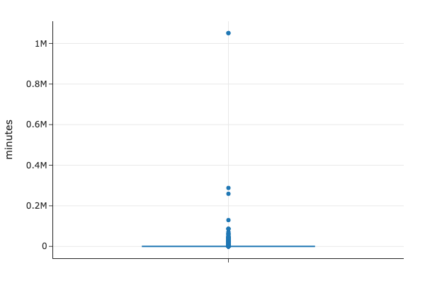
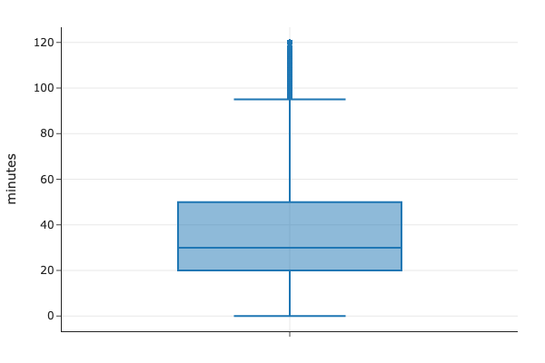
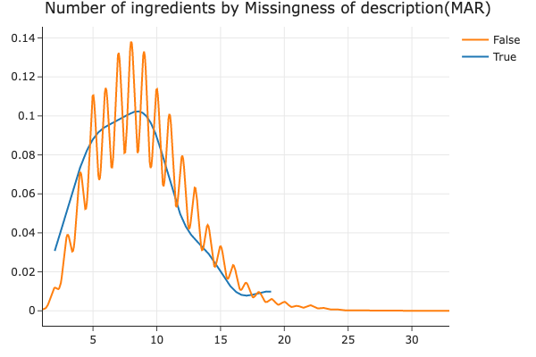
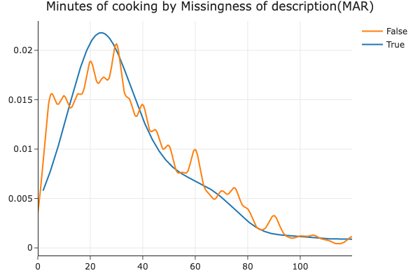

# Prediction of Minutes in Recipe

**Name(s)**: Yixuan Xin, Felix Najera

**Website Link**:[ (https://folicks.github.io/recipe_satisfaction/)]

## introduction

Recipe and rating is an important reference when we making food, providing reliable indication of the food quality and taste, as well as the energy and complexity to finish cooking. Time, in nowadays, becomes more crutIal when people live in such a high speed life, so understanding what factors are correlate with it is one question we are interested in. In our project, we focus on how to predict the cooking time(minutes) utilizing different categorical, numerical, and textual features. Our model tries to use statistical analysis method, including permutation test, hypothesis tests and the missing data analysis to conduct the exploratory analysis. We also build decision tree regressor to predict the detailed relationship between them. Overall, this project aims to shine light on how to make people more efficient cooking food with viable time management. 

Research Questions: The research question we have is how to predict the cooking time. We want to use factors from the dataframe to predict using a regression model.

<table border="1" style="border-collapse: collapse; width: 100%; text-align: left;">
  <thead>
    <tr>
      <th>Column</th>
      <th>Description</th>
    </tr>
  </thead>
  <tbody>
    <tr>
      <td>Name</td>
      <td>Name of recipe</td>
    </tr>
    <tr>
      <td>Id</td>
      <td>Recipe id</td>
    </tr>
    <tr>
      <td>Minutes</td>
      <td>Time to cook</td>
    </tr>
    <tr>
      <td>Contributor_id</td>
      <td>User id who uploaded the recipe</td>
    </tr>
    <tr>
      <td>Submitted</td>
      <td>Date recipe was uploaded</td>
    </tr>
    <tr>
      <td>Tags</td>
      <td>Food.com tags for recipe</td>
    </tr>
    <tr>
      <td>Nutrition</td>
      <td>Nutrition information (calories, total fat, sugar, sodium, protein, saturated fat, etc.)</td>
    </tr>
    <tr>
      <td>N-steps</td>
      <td>Number of steps to cook</td>
    </tr>
    <tr>
      <td>Steps</td>
      <td>Text for recipe steps in order</td>
    </tr>
    <tr>
      <td>Description</td>
      <td>User-provided description</td>
    </tr>
    <tr>
      <td>Ingredients</td>
      <td>Text for recipe ingredients</td>
    </tr>
    <tr>
      <td>N-ingredients</td>
      <td>Number of ingredients in recipe</td>
    </tr>
  </tbody>
</table>

The second dataset interactions have 731927 rows and 5 columns.
<table border="1" style="border-collapse: collapse; width: 100%; text-align: left;">
  <thead>
    <tr>
      <th>Column</th>
      <th>Description</th>
    </tr>
  </thead>
  <tbody>
    <tr>
      <td>user_id</td>
      <td>user ID</td>
    </tr>
    <tr>
      <td>recipe_id</td>
      <td>Recipe ID</td>
    </tr>
    <tr>
      <td>Date</td>
      <td>Date of interaction</td>
    </tr>
    <tr>
      <td>Rating</td>
      <td>Rating given</td>
    </tr>
    <tr>
      <td>Review</td>
      <td>Review text</td>
    </tr>
  </tbody>
</table>

The two Dataframe both have recipe_id(id) and also the columns we are interested in, including ’n-steps’, ’n-ingredidents’, ‘tags’ and ‘description’. Specifically, the dataset has a strong skewed trend of the features, even include our interesting factors, so to better capture the most data we need to clean the dataset and focus on the main part of them.

## Data Cleaning and Exploratory Data Analysis

We do several steps to make our data more concise and useful. Here are the steps we conduct:
1. Merging two dataframes together: We left merge the two dataset on the id column so it will keep all rows food have and help to match all unique recipes with it’s ratings and reviews. 
2. Filling ratings with null values: We fill all ratings of 0 with np.nan, and the purpose is to filter invalid reviews. Since the rating will start from 1 to 5, 0 represents missing values.
3. We create another column ‘average_rating’ which is the rating per recipe by using groupby and mean function, and then we add this series back to the original dataframe using merge again.
4. We clean up the outliers for the minutes column. As we see that the max value of ‘minutes’ is 1051200, while the minimum value is 0, meaning the range is too large to incorporate, so we decide to remove outliers outside the 1.5 interquartile range but only keep the middle.

All the columnns of the cleaned df include:
<table border="1" style="border-collapse: collapse; width: 100%; text-align: left;">
  <thead>
    <tr>
      <th>Column</th>
      <th>Description</th>
    </tr>
  </thead>
  <tbody>
    <tr>
      <td>Name</td>
      <td>Name of recipe</td>
    </tr>
    <tr>
      <td>Id</td>
      <td>Recipe id</td>
    </tr>
    <tr>
      <td>Minutes</td>
      <td>Time to cook</td>
    </tr>
    <tr>
      <td>Contributor_id</td>
      <td>User id who uploaded the recipe</td>
    </tr>
    <tr>
      <td>Submitted</td>
      <td>Date recipe was uploaded</td>
    </tr>
    <tr>
      <td>Tags</td>
      <td>Food.com tags for recipe</td>
    </tr>
    <tr>
      <td>Nutrition</td>
      <td>Nutrition information (calories, total fat, sugar, sodium, protein, saturated fat, etc.)</td>
    </tr>
    <tr>
      <td>N-steps</td>
      <td>Number of steps to cook</td>
    </tr>
    <tr>
      <td>Steps</td>
      <td>Text for recipe steps in order</td>
    </tr>
    <tr>
      <td>Description</td>
      <td>User-provided description</td>
    </tr>
    <tr>
      <td>Ingredients</td>
      <td>Text for recipe ingredients</td>
    </tr>
    <tr>
      <td>N-ingredients</td>
      <td>Number of ingredients in recipe</td>
    </tr>
    <tr>
      <td>user_id</td>
      <td>user ID</td>
    </tr>
    <tr>
      <td>recipe_id</td>
      <td>Recipe ID</td>
    </tr>
    <tr>
      <td>Date</td>
      <td>Date of interaction</td>
    </tr>
    <tr>
      <td>Rating</td>
      <td>Rating given</td>
    </tr>
    <tr>
      <td>Review</td>
      <td>Review text</td>
    </tr>
    <tr>
      <td>average rating</td>
      <td>average rating per recipe</td>
    </tr>
  </tbody>
</table>

## Univariate Analysis
Look at the distributions of relevant columns separately by using DataFrame operations and drawing at least two relevant plots.
Embed at least one plotly plot you created in your notebook that displays the distribution of a single column (see Part 2: Report for instructions). Include a 1-2 sentence explanation about your plot, making sure to describe and interpret any trends present. (Your notebook will likely have more visualizations than your website, and that’s fine. Feel free to embed more than one univariate visualization in your website if you’d like, but make sure that each embedded plot is accompanied by a description.)

We conduct box plots for the column minutes and to have a peek of the distribution over all, and the result demonstrates that the range is too large, from 0 to 1 million, confirming the need of outliers removal we did above. The cleaned distribution is shown in the next graph. Now the range of the minutes is from 0 to 120.

The histogram reveals a right skewed trend, hinting most recipes are quick and some of them are designed for elaborate cooking processes.

## Bivariate Analysis
We try to create box-plot between the number of steps and minutes, but as the distribution shown before, 'n_steps' is a numerical feature so the box plot will have around 80 categories, so we divide n_steps into different categories manually to visualize the data clearly.

Descriptions: The median cooking time increases with recipe complexity, and the interquartile range(IQR) also improves as the steps increase. Thus, the trend may hints a positive correlation between the cooking time and the number of steps.

## Assessment of Missingness

As the series shows below, we have five columns containing missing values, including 'rating','review','name', 'description' and 'average_rating'. 

## NMAR Analysis
- Average_rating: Since 'average_rating' comes from 'rating', the missingness of 'average_rating' is highly correlated with another column, so its missingness should be 'MAR'(Missing At Random).
- Review: NMAR: Since there are 57 missing review, because people are less likely to leave comments if they are unsatisfied with the food or they have neutral feelings toward it. Name: MCAR; This is missed by accident because there is only one row over 234428 recipes, and it is possible the people just forget to put the name in.
- Description: MAR; since other columns are already enough to get the detail of the recipe, so adding more description may be necessary, but we will prove it in the next section.
- Rating: MAR; Rating is the missing part because we manually change 0 to np.nan to let it represent missing. We guess rating is missing due to other columns like n_steps based on the positive correlation we demonstrated in the bivariate analysis.
  
## Missingness Dependency
- Null hypothesis: description is independent
- Alternative hypothesis: description depends other columns
- Test statistic: difference in mean
- Result: The permutation test shows that the p_value is 0.036, meaning we reject the null hypothesis that rating is independent under alpha=0.05; so description is MAR on the n_ingredients column.

When we try to run permutation test on a different column, minutes for description, we found that the p_value is 0.66 which is too high for a significant value of 0.05, so we conclude that the missingness of description does not depend on minutes.

From the graph, we can see that number of ingredients’ distribution is generally similar between the missing description and the non-missing description, and since the p_value is quite low, we predict that there is still significant relationship between these two columns. The interesting part of the graph is the curly shifting part, with recipes missing descriptions having higher density at lower ingredient counts. Moreover,since the density is decreasing as we increase the number of ingredients, there might be a weak negative relationship.

From this graph, the distribution of cooking minutes appear similar with the missing descriptions and non-missing descriptions, indicating a minor difference between he missingness and the time, so align with the high p-value(0.6), indicating that the observed difference may come from randomness. There is no correlation with the cooking time.

## Hypothesis Testing
We are interested in what may affect, or correlate, the cooking complexity, we want to use one feature to get a brief linear relationship. The question we are interested in is the relationship between the distribution of cooking time(as an indication of complexity) and the number of steps. We choose the test statistic pearson correlation because both y and x are continous numerical features.Besides, as the bivariate analysis shows, there is a positive relationship between them, we want to progressively quantify the stength and direction of their relationship, so we choose r. r is defined as the Covariance between X(n_steps) and y(minutes) divided by the product of the standard deviation of X and y. 
- null hypotheis:  The distribution of minutes is not correlated with the number of steps
- alternative hypothesis: The distribution of minutes is positively correlated with the number of steps
- test statistics: Pearson correlation coefficient (r)

Our result shows, the p-value is approximately 0 and r is positive, which rejects the null hypothesis. The correlation coefficent r is around 0.43, which is a moderately positive relationship between cooking time and the steps, meaning cooking time may also correlate with other features, so our next step is to incorporate more features to predict the cooking time, which will be elaborate in step 5. 

## Framing a Prediction Problem
 
We try to address a regression problem: predicting cooking times(‘minutes’ column) using different features from the dataset. This prediction problem aligns with the part we interest, time is a crucial aspect of recipe reparatoin that users may want to estimate based on recipe features. To address this, we will utilize the decision tree regressor because Decision trees are highly interpretable and capable of captureing complicated features, which works on our dataset having many different columns(18). Besides, considering the missingness analysis we did before, our data is flawed in completeness, so choosing decision tree is a great choice because it can split data without imputation needed. Moreover, decision trees are robust to outliers and random noise, making our data more generalized.

Features we plan to incorporate in the model:
- n_steps:number of steps 
- n_ingredients:number of ingredients, reflection of recipe complexity
- number of tags: features we create from tags, potentially hinting the complexity
- description: textual feature directly reflect the cooking time
- tags: list of tags for each recipe, potentially hintitng complexity.

## Baseline Model

Model evaluation: For the baseline model, we decide to use features that are more straightforward and easy to fit, such as numbers and categories, so we choose n_steps, n_ingredients, n_tags and we use categorical_steps. We choose decision tree regressor to predict the minutes because it could handle a variety of data types, including numerical, categorical, and ordinal. Besides, it is robust to outliers, which is common in the n_ingredients and n_steps columns. Moreover, it does not assume any relationship, either linear or colinear, enable us to better fits the datapoints. 
Features types: Four of them are numerical, and one of them is categorical. 
Numerical data, we use StandardScaler to normalize them. The reason is they have differenr ranges making it hard to compare on a scale. So we transform the data with a mean of 0 and a standard deviation of 1.  
- n_steps:number of steps
- n_ingredients:number of ingredients
- n_tags: features we create from tags, potentially hinting the complexity
- average_rating: this is a discrete numerical feature, so we need to normalize it as well

Categorical data, we will one hot encoding it to a binary format to interprete the classfication.
- categorical_steps: it has four unique columns, including 'very easy', 'easy', 'hard', 'very hard'.

Metrics: r square, or the coeeficient of determination is a measurement of the quality of fitting, giving the proporiton of variance the model explains.

Result: This model reach an accuracy of 93.5% on the train set, representing successfully fit 93.5% training data, which is really good. The testing score is 61% for the test set, meaning it explains 61% of the variance of theunseen data. Comparing to the high train score, the much lower test score has a moderate statistical significance but may lead to overfitting. Therefore, to improve the model's generalization to unseen data, we plan to including other features and refine the feature engineering process. 

## Final Model

For the final model, we add two more features, categorical_steps and the tags. The general reason is we want to incorporate more feature types but not only the numerical data and conduct different feature engineering methods such as one-hot encoding. 

Categorical data, we will one hot encoding it to a binary format to interprete the classfication.
- categorical_steps: it has four unique columns, including 'very easy', 'easy', 'hard', 'very hard'.

Textual data: we will conduct a MultiLabelBinarizerTransformer on this feature. The transformer does a one-hot encoder similar function on the tags columns, which is a list of strings, after the transformation the lists of strings become a multilabel format, to make us easifer recognize different labels and count them either 0 or 1. The reason why we use this method is we notice tags take up a large space into the overall dataframe, and the column n_tags shows that each row has a mean of 245 tags. Therefore, we try to incorpate it into the analysis and the way to do one-hot encoding in such a large range would be MultiLabelBinarizerTransformer.

Result: it shows that we achieves a 99% of train score and a 94.6% test scores. Both of them are really high, meaning the accuracy is valid and our data is not overfitting. Even for the unseen data the model will work because the test_score is also high.

## Fairness Analysis

We have conducted a fairness analysis on the final model using a permutation test on the Root Mean Squared Error (RMSE) and R^2 evaluation metrics. The analysis aims to answer the question: "Does the model perform worse for recipes with fewer ingredients (Group X) compared to recipes with more ingredients (Group Y)?"

The choice of groups, hypotheses, test statistic, and significance level are as follows:

Group X: Recipes with fewer than 5 ingredients.
Group Y: Recipes with 5 or more ingredients.
Hypotheses
For RMSE:

Null Hypothesis (H0): The RMSE for Group X and Group Y is approximately the same.
Alternative Hypothesis (Ha): The RMSE for Group X is higher than for Group Y.
For R^2:

Null Hypothesis (H0): The R^2 for Group X and Group Y is approximately the same.
Alternative Hypothesis (Ha): The R^2 for Group X is lower than for Group Y.
Test Statistic: Difference in RMSE (ΔRMSE) or R^2 (ΔR^2) between Group X and Group Y.

Significance Level (α): 0.05.

Results
Observed RMSE Difference: -35.19709718906216
Observed R^2 Difference: 139.86422398687952
P-value for RMSE: 0.0 (We reject the null hypothesis for RMSE, indicating potential unfairness.)
P-value for R^2: 0.0 (We reject the null hypothesis for R^2, indicating potential unfairness.)
Given the results, we have evidence to suggest that the model performs worse for recipes with fewer ingredients (Group X) compared to recipes with more ingredients (Group Y). This indicates potential unfairness in the model's performance.

